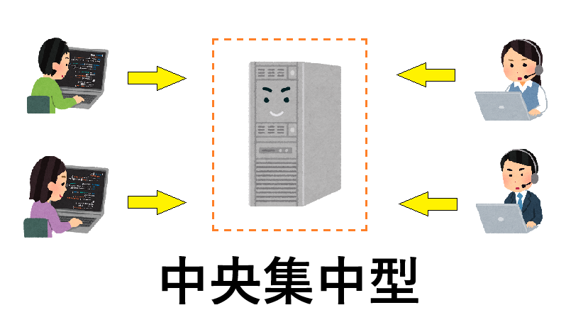
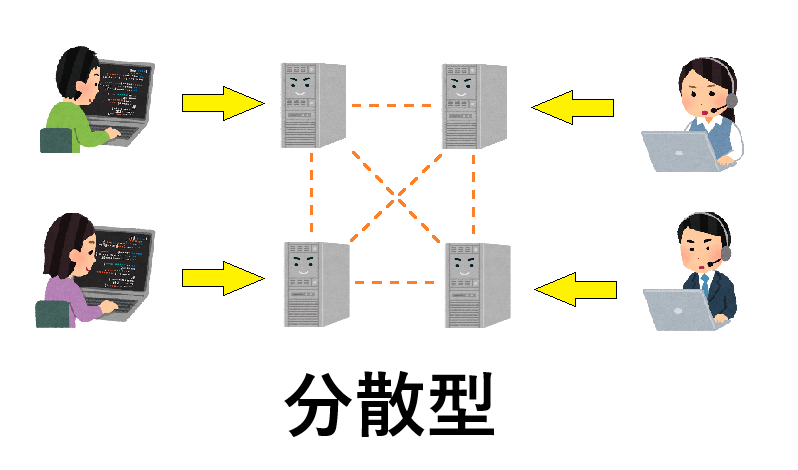

# **学習レポート（Gitの仕組みと活用方法についての振り返り）**

作成者：小林 祐太  
作成日：2025/12/22（月）  
___  
___  

* Gitの仕組みについて  
  Gitはバージョン管理システムの一種で、「中央集中型システム」と「分散型システム」に分類されるバージョン管理のうち、  
  分散型システムが採用されている。  
  分散型システムの特徴として、他のリポジトリと同期したリポジトリをユーザ毎にそれぞれ保有することが可能。  
  それにより、中央集中型システムで発生し得る単一障害点によりバージョン管理ができなくなるといった様な心配がなく、  
  各ファイルの変更履歴や記録の管理をしやすい。  
  中央集中型イメージ図  
  分散型イメージ図  

  その他の特徴として、  
  ① ファイルの変更を差分ではなくスナップショット（変更時点の全体の状態）で管理するため、  
  　変更時の確認や環境の再現がしやすい  
  ② Gitのブランチはポインタによる参照形式であるため、ブランチの作成・削除が高速、かつ  
  　複数のブランチで同じ履歴を共有できる  
  ③ 同一ファイルの同一箇所（同一行）を複数のユーザが修正した場合、マージ時点でGitがコンクリフトを検知するため、  
  　ブランチ開発後の上書きによるマージミスを減少できる  
  等の利点がある。  
___  

* Gitの活用方法について  
  ① ユーザー単位（個人単位）での作業履歴の管理  
  　こまめなコミットやわかりやすいコミットメッセージを残すことで、どの時点でどんな修正を行っていたかが履歴として残せるため、  
  　トレーサビリティ面で見ても有用、かつ環境の再現がしやすい 。  
  　また、リベースやタグ等の機能もあわせて利用することで、履歴・ソース管理がさらに行いやすくなる   

  ② チーム開発時におけるコード管理  
  　システム側でのコンクリフトの検知や、サブブランチ開発後にメインブランチへマージする際のプルリクエストによる  
  　レビューシステム等を活用することで、マージミスやデグレの未然防止が期待できる。  
  　また、ブランチを作成することで複数人が同じコードを占有せずに修正できるため、人的リソースの有効活用にもつながる  

  ③ レビューシステムの活用によるソースコードの品質向上  
  　Gitでは、ソースコードのレビュー依頼・レビューをシステムとして依頼しやすい環境になっている。  
  　そのため、プルリクエスト時にレビュワーを設定してレビューを依頼することで、前述②のような活用方法に加え、  
  　レビューによるソースコードの品質向上にもつながる  
___  

* 学習を振り返ってみて  
  これまで使用した経験のある構成管理システムが、日立製作所系列で使われていた「ReCa(おそらく中央集中型)」という  
  システムのみでした。それと比べて、まだまだ機能をうまく使いこなせていない現状であっても、品質管理や履歴管理の面が  
  特に優れていると個人的に感じられました。  
  今後確実に利用頻度は増えるため、毎日少しずつ操作を繰り返して行うことで、Gitに関する理解度や知識、操作方法等を  
  自身の中で定着させて行きたいと考えております。
___  
